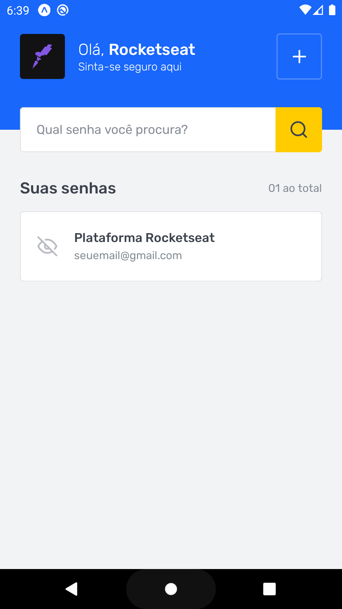
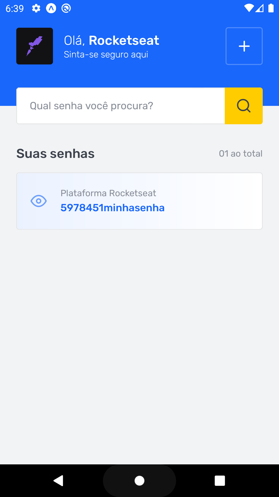
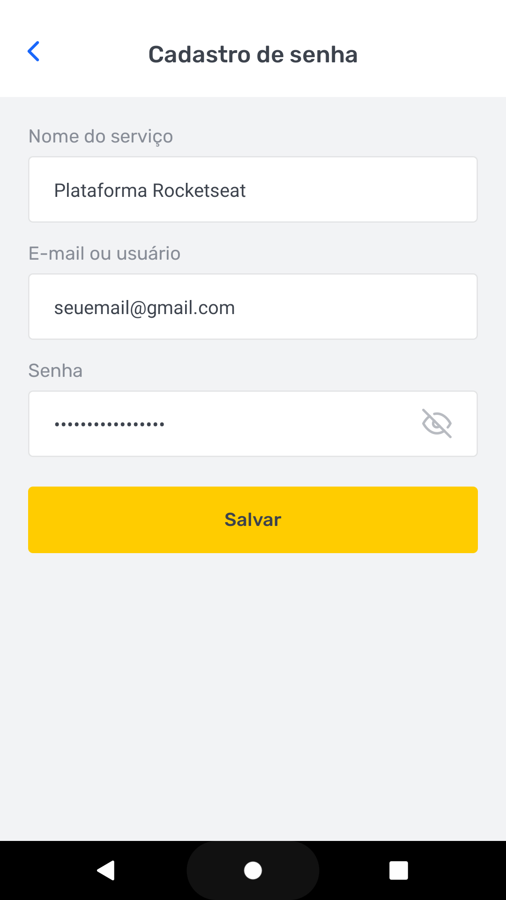

<h1 align="center">
  SavePass
</h1>

<p align="center">
  

 
</p>

<p align="center">

  
  
  
  
  

</p>


## 💻 Projeto
SavePass é uma aplicação Mobile com o objetivo de gerenciar suas senhas das suas contas de redes sociais e serviços

## :hammer_and_wrench: Features 

- [x] Salvar dados no LocalStorage
- [ ] Dark Mode

## ✨ Tecnologias

- [x] React Native
- [x] Typescript
- [x] Expo
- [x] Async Storage

## Executando o projeto

Utilize o **yarn** ou o **npm install** para instalar as dependências do projeto.
Em seguida, inicie o projeto.

```cl
expo start
```

## 📄 Licença

Esse projeto está sob a licença MIT. Veja o arquivo [LICENSE](LICENSE.md) para mais detalhes.

<br />

<div align="center">
  <p>Desenvolvido por Thiago Silva</p>

  [](https://www.linkedin.com/in/thiago-furtado-silva/) 
</div>